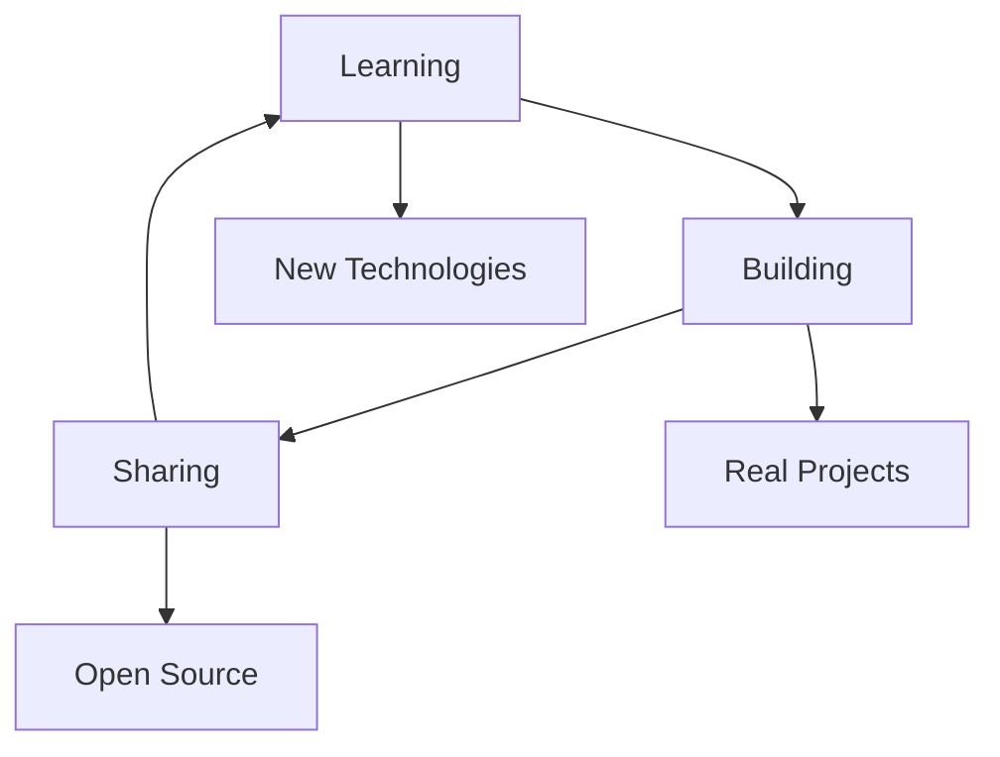

<div align="center">
  
</div>

<div align="center">
  
</div>

<div align="center">
  
  
  
</div>


## 🚀 About Me

```typescript
const developer = {
  name: "Bimoraa",
  role: "Full Stack Developer",
  location: "Indonesia",
  experience: "Always growing",
  
  currentlyLearning: [
    "Advanced React Patterns",
    "Cloud Architecture", 
    "DevOps Practices",
    "Mobile Development"
  ],
  
  interests: [
    "Web Development",
    "Mobile Apps",
    "UI/UX Design",
    "Open Source"
  ],
  
  goals: {
    2024: "Build amazing projects and contribute to open source",
    future: "Create impactful solutions for real-world problems"
  }
};
```

## 📊 GitHub Analytics

<div align="center">
  
  
</div>

<div align="center">
  
</div>

<div align="center">
  
</div>

## 💻 Tech Stack

<div align="center">

### Languages


### Frontend


### Backend


### Tools & Others


</div>

## 🏆 GitHub Trophies

<div align="center">
  
</div>

## 🎯 Current Focus

<div align="center">
  


</div>

- 🔭 Currently working on **full-stack web applications**
- 🌱 Learning **cloud technologies and DevOps**
- 👯 Looking to collaborate on **open source projects**
- 💬 Ask me about **web development, JavaScript, and tech in general**
- ⚡ Fun fact: **I love solving complex problems with simple solutions**

## 📫 Let's Connect

<div align="center">
  
[](https://discord.com/users/your-discord-id)
[](https://instagram.com/your-instagram)
[](mailto:your-email@gmail.com)
[](https://linkedin.com/in/your-profile)

</div>

<div align="center">
  
  
</div>

<div align="center">
  
</div>


<div align="center">
  
</div>

<div align="center">
  
</div>