<div align="center">
  
</div>

<div align="center">
  
</div>

<div align="center">
  
  
  
</div>

<br/>

<div align="center">
  
</div>

## 🧑‍💻 About Me

```typescript
interface Developer {
  name: string;
  role: string;
  location: string;
  experience: string;
  currentFocus: string[];
  passions: string[];
  vision: {
    shortTerm: string;
    longTerm: string;
  };
}

const bimoraa: Developer = {
  name: "Bimoraa",
  role: "Full Stack Developer",
  location: "Indonesia 🇮🇩",
  experience: "Continuously evolving",
  
  currentFocus: [
    "React & Next.js Ecosystem",
    "Cloud-Native Development",
    "Microservices Architecture",
    "Mobile-First Design"
  ],
  
  passions: [
    "Clean Code Architecture",
    "User Experience Design",
    "Performance Optimization",
    "Open Source Contribution"
  ],
  
  vision: {
    shortTerm: "Master modern web technologies & contribute to impactful projects",
    longTerm: "Create innovative solutions that make a difference in people's lives"
  }
};
```

## 📊 GitHub Statistics

<div align="center">
  <picture>
    <source media="(prefers-color-scheme: dark)" srcset="https://github-readme-stats.vercel.app/api?username=bimoraa&show_icons=true&count_private=true&hide_border=true&title_color=667eea&icon_color=764ba2&text_color=9f9f9f&bg_color=1a1b27&border_radius=15&cache_seconds=86400">
    
  </picture>
  
  <picture>
    <source media="(prefers-color-scheme: dark)" srcset="https://github-readme-stats.vercel.app/api/top-langs/?username=bimoraa&layout=compact&hide_border=true&title_color=667eea&text_color=9f9f9f&bg_color=1a1b27&border_radius=15&langs_count=8&cache_seconds=86400">
    
  </picture>
</div>

<div align="center">
  <picture>
    <source media="(prefers-color-scheme: dark)" srcset="https://streak-stats.demolab.com?user=bimoraa&theme=react&hide_border=true&border_radius=15&background=1a1b27&stroke=667eea&ring=764ba2&fire=ff6b6b&currStreakNum=9f9f9f&sideNums=9f9f9f&currStreakLabel=667eea&sideLabels=667eea&dates=6c6c6c">
    
  </picture>
</div>

<div align="center">
  <picture>
    <source media="(prefers-color-scheme: dark)" srcset="https://github-readme-activity-graph.vercel.app/graph?username=bimoraa&custom_title=📈%20Contribution%20Activity&bg_color=1a1b27&color=9f9f9f&line=667eea&point=764ba2&area_color=667eea&title_color=667eea&area=true&hide_border=true&radius=15">
    
  </picture>
</div>

## 🛠️ Technology Stack

<div align="center">
  
### 🎨 Frontend Technologies
<div>
  
</div>
<div>
  
</div>

### ⚙️ Backend & Database
<div>
  
</div>
<div>
  
</div>

### 🔧 Tools & DevOps
<div>
  
</div>
<div>
  
</div>

</div>

## 🏆 Achievements

<div align="center">
  
</div>

## 🎯 Current Journey

```mermaid
graph LR
    A[🎯 Learn] --> B[🔨 Build]
    B --> C[🤝 Share]
    C --> A
    
    A --> D[📚 New Tech]
    B --> E[💼 Projects]
    C --> F[🌟 Open Source]
    
    style A fill:#667eea,stroke:#333,stroke-width:2px,color:#fff
    style B fill:#764ba2,stroke:#333,stroke-width:2px,color:#fff
    style C fill:#ff6b6b,stroke:#333,stroke-width:2px,color:#fff
```

<div align="center">



</div>

<div align="center">
  <table>
    <tr>
      <td align="center" width="33%">
        
      </td>
      <td align="center" width="33%">
        
      </td>
      <td align="center" width="34%">
        
      </td>
    </tr>
  </table>
</div>

- 💬 **Ask me about:** Web Development, JavaScript/TypeScript, React Ecosystem
- ⚡ **Fun fact:** I believe in the power of clean code and beautiful user experiences
- 🎨 **Design philosophy:** "Simplicity is the ultimate sophistication"

## 🌐 Connect With Me

<div align="center">
  <a href="https://discord.com/users/1118453649727823974">
    
  </a>
  <a href="https://instagram.com/32encrypted">
    
  </a>
  <a href="mailto:starrykitsch@gmail.com">
    
  </a>
</div>

## 📊 Profile Metrics

<div align="center">
  
  
  
</div>

## 💭 Daily Inspiration

<div align="center">
  
</div>

---

<div align="center">
  
</div>

<div align="center">
  
</div>

<div align="center">
  
</div>
