<!-- Modern GitHub Profile Design -->
<div align="center">
  
# 👋 Hello, I'm Bimoraa

<div>
  
</div>

<div style="margin: 20px 0;">
  
  
  
</div>

</div>

---

## 🧑‍💻 About Me

```typescript
const developer = {
  name: "Bimoraa",
  role: "Full Stack Developer",
  location: "Indonesia 🇮🇩",
  
  currentTech: [
    "React", "Next.js", "TypeScript", "Node.js",
    "Python", "PostgreSQL", "MongoDB", "Docker"
  ],
  
  currentFocus: [
    "🔥 Building scalable web applications",
    "☁️ Learning cloud-native technologies", 
    "🎨 Crafting exceptional user experiences",
    "🤝 Contributing to open source"
  ],
  
  codePhilosophy: "Clean code, beautiful UX, scalable solutions",
  lifeGoal: "Create technology that makes a positive impact"
};
```

---

## 📊 GitHub Analytics

<div align="center">
  
<table>
<tr>
<td width="50%">

### 📈 Profile Stats


</td>
<td width="50%">

### 🔥 Streak Stats


</td>
</tr>
</table>

### 💻 Most Used Languages


</div>

---

## 🛠️ Tech Stack

<div align="center">

### Frontend
<div style="margin: 10px 0;">
  
  
  
  
</div>

### Backend
<div style="margin: 10px 0;">
  
  
  
  
</div>

### Database & Cloud
<div style="margin: 10px 0;">
  
  
  
  
</div>

</div>

---

## 🎯 Current Journey

```mermaid
graph TD
    A[🔍 Learn] --> B[🛠️ Build]
    B --> C[🚀 Deploy]
    C --> D[📊 Analyze]
    D --> A
    
    A --> E[📚 New Technologies]
    B --> F[💡 Creative Solutions] 
    C --> G[🌐 Real Impact]
    D --> H[📈 Continuous Improvement]
    
    style A fill:#58A6FF,stroke:#21262D,stroke-width:2px,color:#fff
    style B fill:#7C3AED,stroke:#21262D,stroke-width:2px,color:#fff
    style C fill:#F85149,stroke:#21262D,stroke-width:2px,color:#fff
    style D fill:#3FB950,stroke:#21262D,stroke-width:2px,color:#fff
```

<div align="center">



</div>

<div align="center">
  
| 🔭 Working On | 🌱 Learning | 👯 Collaborating |
|:---:|:---:|:---:|
| Full Stack Applications | Cloud Architecture | Open Source Projects |
| Mobile-First Design | DevOps Practices | Community Building |
| Performance Optimization | System Design | Knowledge Sharing |

</div>

---

## 🏆 Achievements

<div align="center">
  
</div>

---

## 📈 Activity Graph

<div align="center">
  
</div>

---

## 🌐 Connect With Me

<div align="center">
  
<a href="https://linkedin.com/in/bimoraa">
  
</a>
<a href="https://twitter.com/bimoraa">
  
</a>
<a href="https://instagram.com/bimoraa">
  
</a>
<a href="mailto:bimoraa@example.com">
  
</a>

</div>

---

## 💡 Fun Facts

<div align="center">

🎨 **Design Philosophy:** "Simplicity is the ultimate sophistication"  
💻 **Coding Mantra:** Clean code, readable documentation, scalable architecture  
🚀 **Mission:** Building technology that empowers and inspires  
☕ **Fuel:** Coffee, curiosity, and continuous learning  

</div>

---

## 📊 Profile Analytics

<div align="center">
  


</div>

---

<div align="center">
  
### ✨ Thanks for visiting! Let's build something amazing together! ✨


</div>
